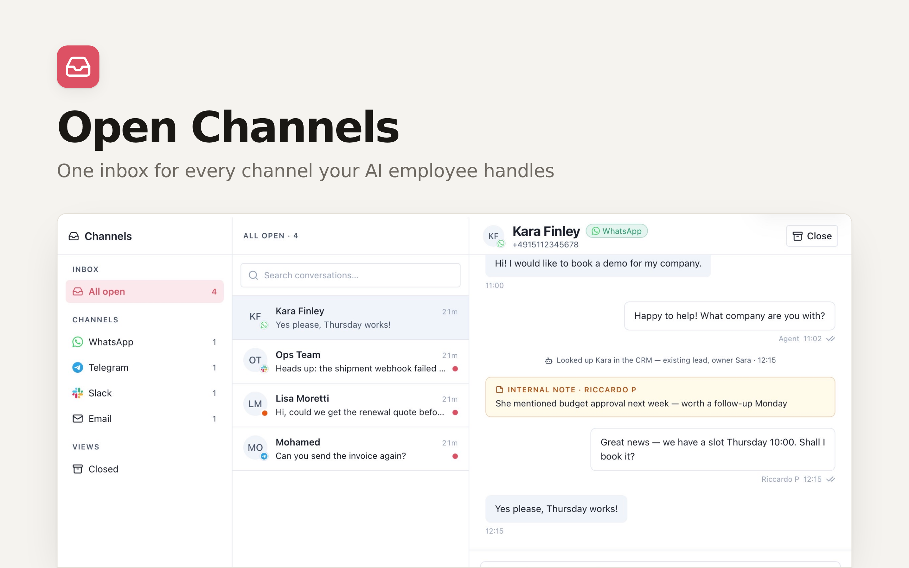

# Open Channels

**Every conversation your AI employee handles — WhatsApp, Telegram, Slack, email — in one inbox.**

[](https://app.clawnify.com/deploy?repo=clawnify/open-channels)

An open-source shared inbox built for teams whose first responder is an AI agent. Where classic shared inboxes exist so *humans* can answer everything, Open Channels exists so a human can *review* everything: the agent triages, drafts, replies and logs what it did; you read one timeline per contact and jump in only when it matters.

## How it works

```
WhatsApp / Telegram / Slack / Email
        │  (channels the agent already sits on)
        ▼
  Clawnify agent ──ingest──▶  Open Channels (this app)
        ▲                     conversations · messages · audit trail
        └────outbox◀──────    replies you compose in the UI
```

- **Ingest** — the agent mirrors every inbound/outbound channel message into the app (`POST /api/ingest`, idempotent per channel message id). History backfill uses the same call.
- **Audit trail** — every action the agent takes on a conversation ("Booked the appointment", "Escalated to Sara") lands as a system line inside the thread.
- **Replies are agent-mediated** — hitting *Send* queues the message; the agent picks it up from `GET /api/outbox`, sends it through the channel's own tools, and confirms delivery. The app has **no channel credentials and no send path of its own**, so your channel allowlists and approval rules keep applying.
- **Internal notes** — comment inside a thread without ever messaging the contact.

## Features

- Three-pane inbox: channels sidebar (live counts) → conversation list (search, unread) → thread
- One conversation per contact, closed threads reopen automatically on new inbound
- Queued / sent / failed delivery states on every outgoing reply
- Multi-tenant by construction (org-scoped rows, platform-injected identity)
- Dark mode, agent mode (`?agent`), keyboard-friendly composer

## Deploy

Runs on the [Clawnify](https://clawnify.com) platform — the agent, channels, database and hosting come with it:

```bash
pnpm install
pnpm deploy        # → https://<slug>.apps.clawnify.com
```

Then tell your agent to read `agent.md` and start mirroring its channels.

## Local development

```bash
pnpm install
pnpm dev           # UI on :5173, API on :8787 (local SQLite)
```

The Vite proxy injects a local dev identity; seed data by curling `POST /api/ingest` with the same headers (see `agent.md` for the payload shape).

## Stack

Hono + React + Vite + D1 (Drizzle) on Cloudflare Workers — the standard Clawnify app template. API surface is OpenAPI-typed and self-documented at `/llms.txt` and `/api/openapi.json`.

## License

MIT
